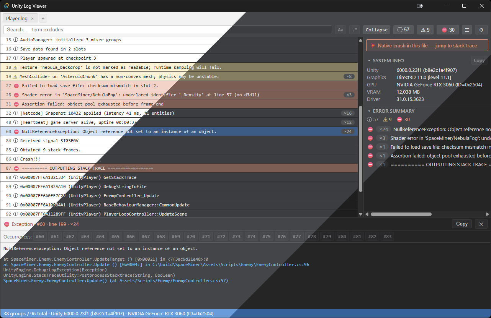

# Unity Log Viewer

*English version: [README.md](README.md)。*

一款檢視 Unity `Player.log` 的桌面工具。它把原始日誌解析成有結構、可搜尋的條目，讓那些會拖垮文字編輯器的大型日誌也能迅速開啟、順暢操作。

`Player.log` 本身沒有時間戳，也沒有等級前綴，用文字編輯器打開就是一整片沒有結構的文字，堆疊追蹤還被拆散成好幾行。這個工具會把每一筆條目連同堆疊追蹤重建起來、判斷嚴重等級、聚合重複訊息，你也可以點一下堆疊幀，直接在 IDE 打開對應的檔案與行號。



## 製作理由

已上線的日誌動輒數百 MB、數十萬行。一般文字編輯器到這個大小就會變得遲鈍，而且完全看不出這個格式帶有的結構：呼叫端堆疊幀、例外區塊、開頭的系統資訊 banner。

現有的 Unity 日誌工具大多落在不同的定位：

- **遊戲內嵌的除錯主控台** 只顯示執行中的建置版本即時吐出的日誌，不是測試人員測試過後的日誌檔。
- **舊式的編輯器視窗檢視器** 雖然能載入檔案，但建立在 Unity 的即時模式 GUI 上，遇到大型日誌就會變慢甚至崩潰。
- **SaaS 崩潰蒐集服務** 功能不錯，但會把你的日誌上傳到第三方，並依用量計費。
- **介面精美的網頁檢視器** 多半是付費、閉源產品的前端。

這個工具走的是離線、本機、開源這條路：替一個已經在你硬碟上的日誌檔，提供一個快速的原生檢視器，不上傳任何東西，也不需付費。

## 功能特色

**開啟日誌** —— 提供多種開啟方式：
- 關聯 `.log` 副檔名後，在檔案總管直接雙擊開啟。
- 把檔案拖進視窗。
- 從最近開啟的檔案、在 LocalLow 下找到的 Player.log，或你自己加入的監看資料夾中挑選。
- 命令列開檔（`UnityLogViewer <路徑>`）；再次啟動會沿用執行中的視窗。

**閱讀**
- 即使 Player.log 沒有時間戳、沒有等級前綴，也能正確解析，並讓多行堆疊追蹤附在所屬條目上。
- 判斷等級（Log、Warning、Error、Assert、Exception）。
- 把重複訊息摺疊成群組，標上 ×N 次數。訊息裡的數值會被遮罩，所以只有數字不同的洗版訊息會併成同一群。
- 詳細面板會顯示完整訊息、格式化後的堆疊追蹤，並提供一個複製原始條目的按鈕。

**尋找**
- 搜尋範圍同時涵蓋訊息與堆疊幀：以空白分隔的關鍵字為 AND 條件，`-term` 為排除，另有大小寫與正規表示式切換。
- 用 F8/Shift+F8 在錯誤之間跳轉，用 1/2/3 切換等級篩選；篩選變動時，你原本選取的條目會保留。
- 標示原生崩潰傾印（含 `OUTPUTTING STACK TRACE` 區段的檔案），並附上跳到該處的連結。

**IDE 深層連結**
- 點擊 `檔案：行號` 堆疊幀，零設定就能在 IDE 打開該行。它會讀取 Unity 設定的外部指令碼編輯器，再依序退回 Visual Studio、Rider 和 VS Code。另提供自訂指令範本作為覆寫。

**分診（Triage）**
- 從日誌 banner 整理出來的系統資訊卡（Unity 版本、繪圖 API、GPU、VRAM、驅動程式），並附一個把摘要複製起來、方便貼進 bug 回報的按鈕。
- 全檔各等級的計數，以及前 10 大重複錯誤清單，每一項都能點擊跳到該條目。

**使用體驗**
- 分頁，亮/灰/深 三種主題，可調整的字體大小（Ctrl+滾輪），列底色標示。偏好設定都保存在本機。

## 效能

解析在原生的 Rust 核心、背景執行緒上進行，所以載入檔案時視窗不會卡住。清單採用虛擬化、分頁按需載入，前端不會持有整份日誌。即使日誌到了數百 MB，捲動和篩選也還是順的。

## 隱私

預設完全離線。它只讀取本機檔案，不發任何網路請求：沒有遙測，任何資料都不會離開你的電腦。唯一的例外是需要你主動開啟的「檢查更新」設定（預設關閉）：開啟後會在啟動時連到 GitHub 查有沒有新版——通知你並附下載連結，或在安裝版上直接下載並安裝。

## 安裝

可以到 [Releases](../../releases) 頁面下載安裝檔或免安裝（portable）版 exe，或自行從原始碼建置。

**⚠️ 第一次執行：** 這些發行版沒有經過程式碼簽章（簽章需要付費憑證），所以第一次執行安裝檔或程式時，Windows 可能會跳出「Windows 已保護您的電腦」的 SmartScreen 視窗。點「其他資訊」再點「仍要執行」即可。這對未簽章的開源程式是正常現象。

從原始碼建置需要 [Rust](https://www.rust-lang.org/tools/install)（stable，Windows 上需要 MSVC 工具鏈）、[Node.js](https://nodejs.org/) 20+，以及 [Tauri 環境需求](https://tauri.app/start/prerequisites/)。WebView2 隨 Windows 10/11 一起附帶。

```bash
npm install
npm run tauri dev      # 開發模式執行
npm run tauri build    # 建置 UnityLogViewer.exe 與安裝檔
```

執行檔會產生在 `src-tauri/target/release/`，MSI/NSIS 安裝檔在 `src-tauri/target/release/bundle/`。執行檔是可攜式的，搬到哪都能跑。

## 快捷鍵

| 按鍵 | 動作 |
| --- | --- |
| `F8` / `Shift+F8` | 下一個 / 上一個錯誤 |
| `1` / `2` / `3` | 切換 Log / Warning / Error 篩選 |
| `Ctrl+F` | 聚焦搜尋框 |
| `Esc` | 清除搜尋 |
| `↑` / `↓` | 移動選取 |
| `Home` / `End` | 跳到頂 / 底 |
| `Ctrl+滾輪`、`Ctrl+=` / `Ctrl+-` / `Ctrl+0` | 縮放文字 |
| `Ctrl+W` / `Ctrl+Tab` | 關閉 / 循環分頁 |

## 平台支援

目前支援並測試過的平台是 Windows 10/11。解析核心本身是跨平台的，但本機日誌掃描、IDE 整合和副檔名關聯目前只支援 Windows。macOS 和 Linux 還沒有對應的建置。

## 技術堆疊

[Tauri 2](https://tauri.app/)、React + TypeScript（Vite），以及一個無外部相依的 Rust 解析核心（`ulv-core`）。解析邏輯和 Tauri 分開，並以單元測試涵蓋（`cargo test`、`npm test`）。

## 開發說明

開發過程中借助 [Claude](https://www.anthropic.com/claude) 協助，設計決策與變更都由作者審閱。

## 開發藍圖

- 書籤

## 授權

Copyright © 2026 bwaynesu。採用 [GNU Affero General Public License v3.0 或更新版本](LICENSE)（AGPL-3.0-or-later）授權。

你可以使用、修改、散布本軟體，但任何經散布或透過網路提供的衍生作品，都必須以 AGPL 授權並附上完整原始碼。不允許製作閉源的分支或產品。
